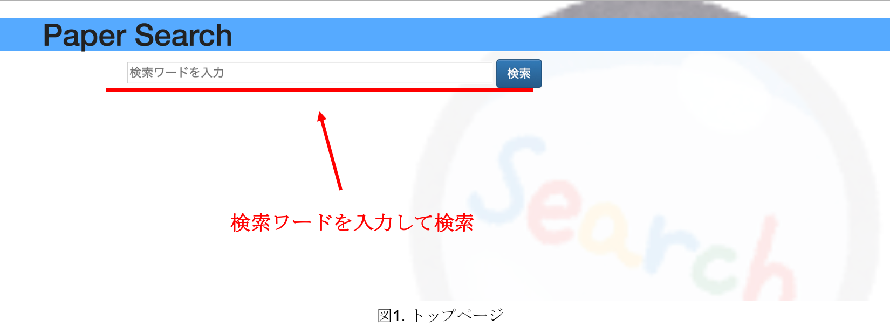
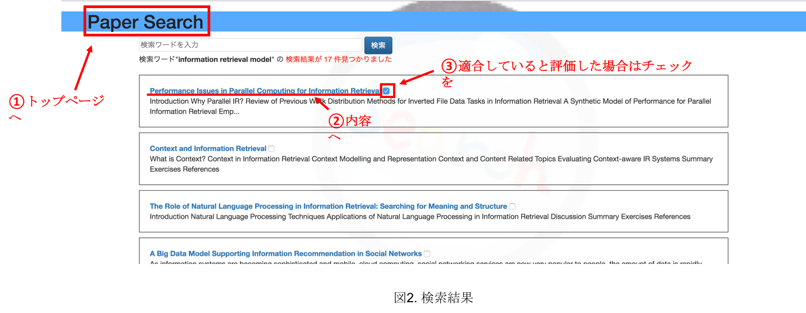
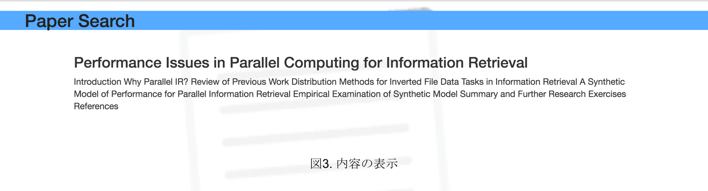
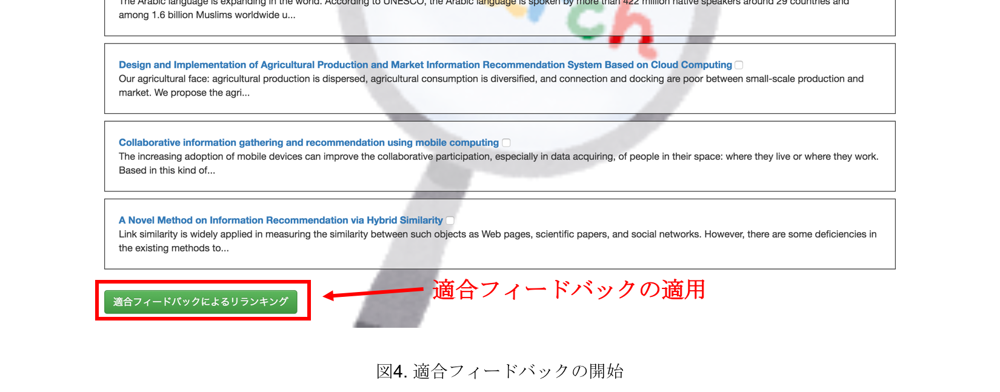
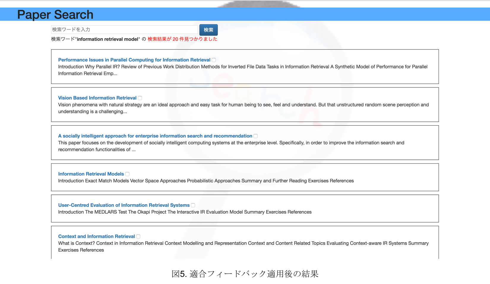

# Information_Retrieval_RF

### ベクトル空間法に基づく情報検索システムの実装演習(適合フィードバック実装)


#### 1. 使用した技術要素
言語:Python3  
フレームワーク:Django  
データベース:SQLite(Djangoの初期設定)  

**文書ベクトル作成時**
* ストップワード削除
* ステミング処理
* TF-IDF

**文書間類似度尺度**
* コサイン類似度

**適合フィードバック**
* Rocchioの式

　
#### 2. 動作確認
**確認環境**  
OS: macOS Sierra バージョン 10.12.6  
ブラウザ: Google Chrome  
言語: Python3.6.2  
以下の必要ライブラリ

**必要ライブラリのインストール**
```
pip(or pip3) install django
pip(or pip3) install nltk
pip(or pip3) install numpy
pip(or pip3) install django-bootstrap-form
```
**ライブラリの設定**  
ターミナルなどのコマンドラインにて"Python3"と入力し対話モードへ  
以下の内容を打ち込む
```python:setup
import nltk
nltk.downloads('stopwords')
exit()
```

**開発用サーバの起動**  
`python(or python3) manage.py runserver`   
アクセス先：http://127.0.0.1:8000/search/index/

　
#### 3. 全体の設計・構成
**ファイル構成**   
Information_Retrieval_RF(プロジェクト名)  
　　|-search(アプリ名)  
　　|　　|--template(HTMLなど表示周り)  
　　|　　|--他(内部の実装)  
　　|  
　　|-search_engine(プロジェクトの設定)  
　　|  
　　|-static(BootstrapやjQuery,背景画像)  

**データベース設計**  
テーブル名:Paper(属性:ID,論文タイトル,論文アブストラクト)  

**機能**
* 論文検索
* 検索結果より論文の内容(アブストラクト)の表示
* 適合フィードバックによる検索結果更新  


#### 4. 使い方
図1から図5は本webアプリケーションの使用法を順に示している。  
　図1は何も出力されていない状態であるトップページである。検索ワードを入力し、”検索”ボタンをクリックすることで検索を開始する。  
  

　図2は検索結果を表示している画面である。上部にあるヘッダー(①)をクリックするとトップページに遷移する。検索結果の各タイトル(②)をクリックするとその文書の内容を表示する画面(図3)へと遷移する。また、検索によって表示された各文書に対して、適合していると評価した文書についてはタイトルの右部のチェックボックス(③)にチェックを入れる。  

  

　図3は図2の画面状態にてタイトルをクリックした際、その内容を表示する画面の例である。  

  

　図4は適合フィードバックを適用する際のボタンを表している。これはチェックボックスのチェック情報に基づいて適合フィードバックを開始する。  
  

　図6は適合フィードバックを適用した際の結果例を表している。この結果に対して更に繰り返し適合フィードバックを適用することもできる。  

  
